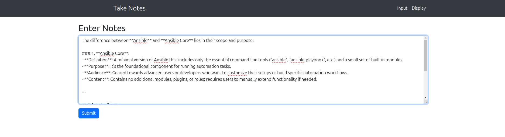
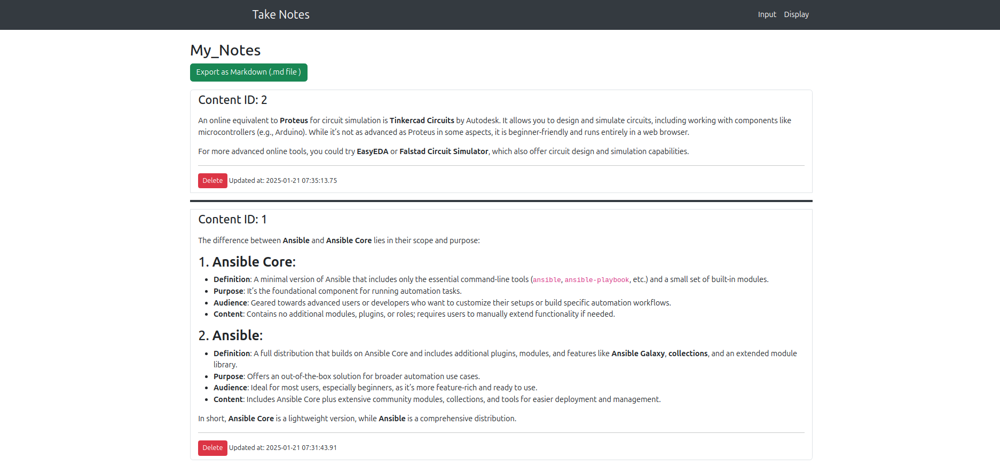

### README for Markdown App

---

## **TakeNotes App**

A simple web application built with Python, Flask, Bootstrap, and SQLite that allows users to input, display, and export content written in Markdown format. The app supports Markdown-to-HTML conversion, timestamped entries, and content export.

---

### **Features**

1. **Input Markdown Content:**
   - A large text box to input content in Markdown format.
   - Submit the content to save it in the database.

2. **Display Content:**
   - Displays saved content as formatted HTML (converted from Markdown).
   - Latest entries are displayed at the top.
   - Each entry includes:
     - Timestamp
     - A "Delete" button to remove the content.
   - Entries are separated by a dark ribbon for better visibility.

3. **Export Content:**
   - Option to download all entries as a single Markdown file.
   - Entries are sorted in reverse chronological order, with a separator between them.

---

### **Technologies Used**

- **Backend:**
  - Python (Flask)
  - SQLite
- **Frontend:**
  - Bootstrap for styling
  - Inline styles for custom UI adjustments
- **Markdown-to-HTML Conversion:**
  - `markdown` Python library
- **Security:**
  - Optional use of `bleach` for sanitizing HTML output

---

### **Setup Instructions**

1. **Clone the Repository:**
   ```bash
   git clone <repository_url>
   cd takenote
   ```

2. **Set Up a Virtual Environment:**
   ```bash
   python3 -m venv venv
   source venv/bin/activate  # On Windows: venv\Scripts\activate
   ```

3. **Install Dependencies:**
   ```bash
   pip install flask flask-sqlalchemy markdown bleach
   ```

4. **Initialize the Database:**
   Open a Python shell and run:
   ```python
   from app import db
   db.create_all()
   ```

5. **Run the Application:**
   ```bash
   python3 app.py
   ```
   Access the app at [http://127.0.0.1:5000](http://127.0.0.1:5000).

---

Input



Display


